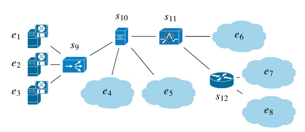
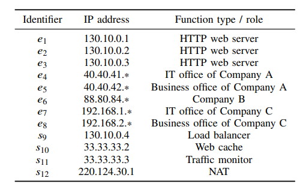
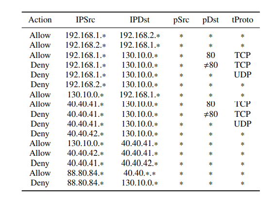
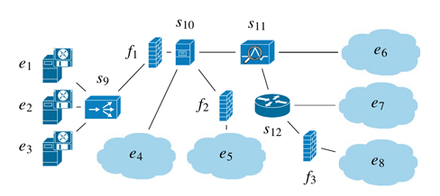
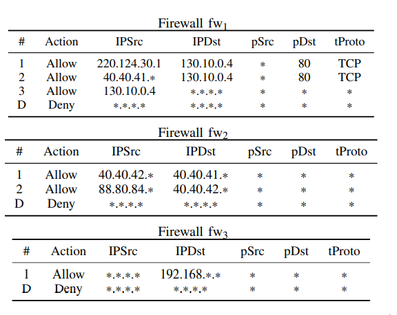

<!--
##### VEREFOO (VErified REFinement and Optimized Orchestrator) is a framework designed to automatically allocate and configure packet filtering firewalls in a service graph defined by the network administrator, so as to fulfill the user-specified security connectivity requirements. VEREFOO combines automation, formal verification and optimization by formulating the firewall configuration problem with constraint programming, as a Maximum Satisfiability Modulo Theories (MaxSMT) problem.
-->

## VEREFOO Architecture
### High Level Overview
VEREFOO (VErified REFinement and Optimized Orchestrator) is a framework designed to automatically allocate and configure packet filtering firewalls in a service graph defined by the network administrator, so as to fulfill the user-specified security connectivity requirements. VEREFOO combines automation, formal verification and optimization by formulating the firewall configuration problem with constraint programming, as a Maximum Satisfiability Modulo Theories (MaxSMT) problem.

### Input and Output

The VEREFOO framework takes as inputs a Service Graph (SG) and a list of Network Security Requirements (NSR) that a SG should satisfy, like data reachability and isolation (data protection requirements are planned to be supported in future versions of VEREFOO). The input is in the form of a single XML file which contains both the SG and the NSRs. After receiving the SG and the NSRs, the
automatic security enforcement problem is solved, which leads to two possible outcomes:
* A positive output, provided as an XML configuration file, easily deployable into the virtual network, composed by:
  * the allocation scheme of the distributed firewall
instances in the SG, which specifies where a firewall instance has to be allocated;
  * the Filtering Policy (FP) for each allocated firewall, which is a set of filtering rules that make up its configuration, expressed in a user-friendly abstract language.
* A negative output in the form of a non-enforceability report, which you can use to guess why it has not been possible to enforce the NSRs.

### Algorithms: AP & MF

This version of VEREFOO is equipped with two algorithms: Maximal Flows (MF) and Atomic Predicates (AP), each of which is suitable for distinct use cases.

The algorithm for the computation of Atomic Flows expresses each complex network predicate (e.g., a predicate
representing a firewall rule, a NAT input packet class, or a
security policy) as a subset of atomic predicates, which are disjoint to each other. The Atomic flows are thus computed so that each transmitted packet class is represented by an atomic predicate, representable by an integer number. This algorithm is suitable for scenarios where the automatic firewall configuration must be as fast as possible, even at the expense of a larger number of rules created.

The algorithm for the computation of Maximal Flows maximizes the aggregation of flows. It groups all traffic flows that behave in the same way into a single Maximal Flow, so that it is sufficient to consider the Maximal Flow for solving the security configuration problem instead of all separate flows. This algorithm is suitable for scenarios where the minimum possible number of firewall rules must be computed, even if the MaxSMT problem resolution may take longer w.r.t using the AP algorithm, since each packet class cannot be associated with an integer value. It is also suitables for formally verifying the compliance of an already existing configuration with a set of user-specified secuirity requirements.

### REACT Version
REACT VEREFOO is a custom version of VEREFOO with additional support for the reconfiguration of packet filtering firewalls, so as to fulfill the user-specified security connectivity requirements. REACT VEREFOO maintains the core principles of VEREFOO (i.e., automation, formal correctness assurance, optimization) and adds the capability of reusing any previously computed configuration instead of forcing the reconfiguration of the whole network from scratch.


## VEREFOO Dependencies

The VEREFOO framework requires the following dependencies to correctly work:
* Java SE Development Kit 8 (https://www.oracle.com/it/java/technologies/javase/javase8-archive-downloads.html)
* Apache Tomcat 8 (https://tomcat.apache.org/download-80.cgi)
* Apache Ant 1.10 (https://ant.apache.org/bindownload.cgi)
* Apache Maven 3.6 (https://maven.apache.org/download.cgi)
* Neo4j Community 3.5.25 (https://neo4j.com/download-center/)
  * For Debian-based Linux distributions: [cypher-shell 1.1.15](https://github.com/neo4j/cypher-shell/releases/download/1.1.15/cypher-shell_1.1.15_all.deb)
and [neo4j 3.5.25](https://go.neo4j.com/download-thanks.html?edition=community&release=3.5.25&flavour=deb) , followed by typing these two commands to install them on your machine  
    ```
    sudo apt install ./cypher-shell_1.1.15_all.deb
    sudo apt install ./neo4j_3.5.25_all.deb
    ```


* Z3 4.8.8 (https://github.com/Z3Prover/z3/releases)

### Z3 library support

Z3 is an automated solver of the MaxSMT problem defined in VEREFOO.

[Download](https://github.com/Z3Prover/z3/releases) the correct version of Z3 according to your OS and your JVM endianness. For the correct functioning of the application, you must have the Z3 native library and include it in the Java Library Path. The most convenient way to do this is to add the library path to the dynamic linking library path, which
* in Linux is `LD_LIBRARY_PATH`
* in MacOS is `DYLD_LIBRARY_PATH`
* in Windows is `PATH`
> e.g., on Linux,
> * `sudo nano /etc/environment`
> * `LD_LIBRARY_PATH = $LD_LIBRARY_PATH:/home/VEREFOO/z3/bin/`

A new environment variable, named Z3, must be also created:
> * `Z3 = /home/VEREFOO/z3/bin/`

## VEREFOO Installation

The VEREFOO framework can be installed in two alternative ways:
* via Maven (recommended);
* via Ant.

### Installing VEREFOO via Maven (Spring Boot application with Embedded Tomcat)  [Solution 1]

* install [jdk1.8.X YY](http://www.oracle.comntechnetwork/java/javase/downloads/jdk8-downloads-2133151.html);
* install [maven](https://maven.apache.org/install.html)
* `mvn clean package`
* `java -jar target/verifoo-0.0.1-SNAPSHOT.jar`


### Installing VEREFOO via Ant (Apache Tomcat required) [Solution 2]

* install [jdk1.8.X YY](http://www.oracle.comntechnetwork/java/javase/downloads/jdk8-downloads-2133151.html);
* install [Apache Tomcat 8](https://tomcat.apache.org/download-80.cgi);
  * set CATALINA HOME environment variable to the directory where you installed Apache Tomcat;
  * (optional) configure Tomcat Manager:
  * open the file ``%CATALINA_HOME%\conf\tomcat-users.xml``
  * under the ``tomcat-users`` tag place, initialize a user with roles  "tomcat, manager-gui, manager-script".  An example is the following content:
   ``xml   <role rolename="manager-gui"/>  <role rolename="manager-script"/>  <role rolename="admin-gui"/>   <role rolename="admin-script"/>  <user username="admin" password="admin" roles="manager-gui,manager-script,admin-scripts"/>``;
  * edit the "to\_be\_defined" fields in tomcat-build.xml with the previously defined credentials;
* execute the `generate` ant task in order to generate the .war file;
* launch Tomcat 8 with the startup script  ``%CATALINA_HOME%\bin\startup.bat`` or by the start-tomcat task ant;
* (optional) if you previously configured Tomcat Manager you can open a  browser and navigate to `this link <http://localhost:8080/manager>`  and login using the proper username and password (e.g.,  ``admin/admin`` in the previous example);
* (optional) you can `deploy/undeploy/redeploy` the downloaded WARs through the web interface.

## VEREFOO Directory Organizazion

The source code of the framework is organized in a clear way through the following folders:
* Allocation  &rarr; files regarding the generation and management of Allocation Graphs/Nodes;
* Extra &rarr; files containing auxiliary classes useful for testing, managing errors and wildcards;
* Firewall &rarr; files regarding the actual application and deployment of produced configuration on the different types of firewalls (e.g., IPTables, OVS, etc...)
* Functions &rarr; files regarding the representation of the different Network Functions, ranging from the EndHost, to the LoadBalancer, to the PacketFilter itself, and many other NF; 
* Graph &rarr; files regarding the management of the flows, addresses, ports, traffic and security requirements;
* Rest &rarr; files for building and managing the REST service using Spring;
* Solver &rarr; files regarding the model and constraints checking for both algorithms (AP and MF);
* Translator &rarr; files regarding the translation of Verefoo output into the correct XML through the use of parser and pattern matchers; 
* Utils &rarr; files regarding general utils, e.g. Atomic Predicates utils, IP address comparator, abstraction of a firewall rule, etc...

Additional files still inside the source folder are:
* Main &rarr; used only for testing the Verefoo execution without relying on the REST API;
* VerefooNormalizer &rarr; hides some limitation of z3 to the final user;
* VerefooProxy &rarr; interface with the Verefoo classes;
* VerefooSerializer &rarr; separates the Verefoo classes implementation from the actual input;


## REST APIs

In order to access the VEREFOO framework, some REST APIs are available when VEREFOO is deployed.

### Connecting to the REST APIs

 Follow these steps to boot the environment, deploy VEREFOO and use the APIs (these instructions refer to the version with embedded Tomcat):

* Run the Neo4j server:
  * On Windows &rarr; open a shell in the folder */neo4j-server/neo4j-community-3.5.25/bin* and type ```./neo4j console```;
  * On Linux &rarr; type ```sudo /usr/bin/neo4j console``` ;
  *  Visit http://localhost:7474/ and log in with username `neo4j` and password `neo4j`, then, when prompted, set your new password to `costLess`;
* Run Tomcat: open another shell in the project root folder and type the following two commands: ```mvn clean package``` and ```java -jar target/verifoo-0.0.1-SNAPSHOT.jar```;
* Interact with the REST APIs: any RESTful client can be used to interact with the VEREFOO APIs; the APIs home URI is [localhost:8085/VEREFOO](localhost:8085/VEREFOO). For any doubt about the REST APIs, their documentation can be found at [localhost:8085/VEREFOO](localhost:8085/VEREFOO) , or by visiting the [Swagger UI Editor Online](https://editor.swagger.io/) and uploading the following [JSON file](/resources/api-docs.json).

### VEREFOO Interaction

#### Select algorithm

In order to interact with VEREFOO, it is necessary to specify the algorithm used. 

To select the algorithm utilized, the query parameter that specifies the algorithm should be included in the REST API request, subsequent to the framework's launch.

> Example:
> * `http://localhost:8085/VEREFOO/adp/simulations?Algorithm=AP` 
> * `http://localhost:8085/VEREFOO/adp/simulations?Algorithm=MF` 

The primary API is `/adp/simulations` as it serves as the API where the algorithm is executed. The Service Graph written in XML must be incorporated in the body of a POST request. It should be noted that the specification of the algorithm, as shown above, is mandatory, otherwise, the framework will return an error.

#### Select version

To interact with REACT VEREFOO, it is necessary to express the request with an additional query parameter. For the moment the implementation supports only the AP algorithm.

> Example:
> * `http://localhost:8085/VEREFOO/adp/simulations?Algorithm=AP&REACT=true`

It should be noted that this parameter is optional, to maintain full compatibility with the previous version and APIs.

### Neo4j compatibility recommendations

The framework was tested with the the Neo4j server version 3.5.25 (Community Edition): it is compatible with the Neo4j Spring Data dependency in use. It is advisable to avoid employing newer versions of the server or Spring Data, despite available, for three main reasons:

* The required JDK for more recent releases may be the JDK 11 at least, while the current compiler for Verifoo is Java 8; the migration to a newer JDK **must** be first agreed with all the developers of the project;
* The configuration of Spring in the file SpringBootConfiguration should be changed because some classes are not available anymore;
* The Neo4j annotations in the DAO classes (which start with *db*) may change formalism.

## Regression Tests

Regression tests can be used to test the framework after any applied change. Two classes of regression tests are availables: tests to check the correctness of the MaxSMT problem resolution, and tests to check the correctness of the REST APIs.

The regression tests to check the correctness of the MaxSMT problem resolution can be launched manually, and they are available in src/it/polito/verefoo/test.

The regression tests to check the correctness of the REST APIs can be launched as follows:
* Run the Neo4j server: open a shell in the folder */neo4j-server/neo4j-community-3.5.25/bin* and type ```./neo4j console```;
* Launch the tests: open another shell in the project root folder and type ```mvn clean verify```.

In case of failure, the detailed report can be found at */target/failsafe-report/failsafe-summary.xml*.

All the regression tests performed on the framework have been executed using the Z3 library version 4.8.8.


## Demo

You can find a full demonstration of the VEREFOO framework at the following link: https://youtu.be/QCFNLE2gHgE . If you prefer, the following paper will guide you through the demonstration in a written-fashion: https://ieeexplore.ieee.org/abstract/document/10175442 . 

In this demo, VEREFOO has been used to automatically compute the firewall allocation scheme and configuration in a virtual network that is devoid of firewalling functionalities.

#### NOTE: the Verefoo version used in this demo is "Budapest", in which the choice between the AP and MF algorithm was not implemented yet.

The input Service Graph represents a ramified network, where multiple different function types are included, e.g., a load balancer, a web cache, a traffic monitor, a network address translators. Some end points are single hosts, whereas other ones are subnetworks representing the office networks of some companies.




 
The input Network Security Requirements establish which traffic flows must be blocked because potentially malicioucs, and which other must be able tor each their destination to ansure network connectivity.



As explained in the [VEREFOO Interaction](#verefoo-interaction) section, you can interact with the framework through REST API; for this demo, the command sent is the following:
> curl -X POST 'http://localhost:8085/verefoo/adp/simulations' -H 'accept: application/xml' -H 'Content-type: application/xml; -d @./testfiles/DemoTopology_budapest.xml > ./testfiles/fas_budapest.xml

where 
* the input file containing both the SG and NSR is specified with `-d @ path/to/input_file.xml`; [this](./resources/demo_files/demo_input.xml) is the XML file given as input during the demo demonstration.
* the Firewall Allocation Schema (FAS) will be saved at the location specified after the > simbol, `> path/to/output_file.xml`; [this](./resources/demo_files/demo_output.xml) is the XML file produced by the framework.

After running the framework, VEREFOO produces two outputs. On the one hand, it establishes the optimal firewall allocation scheme, composed of the minimum number of firewall instances to be placed in the input Allocation Places. On the other hand, for each allocated instance, it computes the optimal configuration, composed of a default action and the smallest set of filtering rules. 





## VEREFOO Main Papers

If you are interested in deepen your knowledge on the subject, the following links will guide you through the four Verefoo versions which followed one another:
* [Amsterdam](https://ieeexplore.ieee.org/abstract/document/9110402) : D. Bringhenti, G. Marchetto, R. Sisto, F. Valenza, J. Yusupov, "_Automated optimal firewall orchestration and configuration in virtualized networks_", in Proc. of IEEE/IFIP Network Operations and Management Symposium, Budapest, Hungary, June 2020. 
* [Budapest](https://ieeexplore.ieee.org/abstract/document/9737389) : D. Bringhenti, G. Marchetto, R. Sisto, F. Valenza, J. Yusupov, "_Automated Firewall Configuration in Virtual Networks_", IEEE Transactions on Dependable and Secure Computing ( Volume: 20, Issue: 2, 01 March-April 2023, Pages: 1559 - 1576) , March 2022.
* [Copenhagen](https://ieeexplore.ieee.org/document/10542398) : D. Bringhenti, S. Bussa, R. Sisto, F. Valenza, "_A two-fold traffic flow model for network security management_", IEEE Transactions on Network and Service Management, in press.
* [Dublin](https://ieeexplore.ieee.org/document/10575212) :  F. Pizzato, D. Bringhenti, R. Sisto, and F. Valenza, “_Automatic and optimized firewall reconfiguration_” in Proc. of IEEE/IFIP Network Operations and Management Symposium, Seoul, South Korea, May 2024.

## Support
If you need any kind of clarification, or you want to report a bug found in the code, you can contact us at: _<daniele.bringhenti@polito.it>_.
